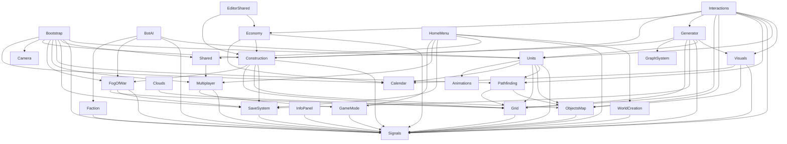

# Feature Dependency Map

Граф залежностей збудовано з asmdef у Assets/Moyva/Scripts (runtime/API/UI модулі, без Editor/Tests).

- Модулів: 27
- Ребер: 71
- Циклів: 0

## Mermaid

## Adjacency List

- Animations: (no outgoing dependencies)
- Bootstrap: Calendar, Camera, Construction, FogOfWar, Multiplayer, Pathfinding, SaveSystem, Shared, Signals, Units
- BotAI: Faction, FogOfWar, Signals, Units
- Calendar: (no outgoing dependencies)
- Camera: (no outgoing dependencies)
- Clouds: Grid
- Construction: FogOfWar, Grid, ObjectsMap, SaveSystem, Signals
- Economy: Calendar, Construction, Signals
- EditorShared: Construction, Economy
- Faction: Signals
- FogOfWar: Grid, SaveSystem, Signals
- GameMode: Signals
- Generator: Construction, GraphSystem, Grid, SaveSystem, Signals, Units, Visuals
- GraphSystem: (no outgoing dependencies)
- Grid: Signals
- HomeMenu: GameMode, Multiplayer, SaveSystem, Shared, Signals, WorldCreation
- InfoPanel: Signals
- Interactions: Construction, Economy, Generator, Grid, ObjectsMap, Pathfinding, Signals, Units, Visuals
- Multiplayer: GameMode, Signals
- ObjectsMap: Signals
- Pathfinding: Grid, ObjectsMap
- SaveSystem: Signals
- Shared: Multiplayer
- Signals: (no outgoing dependencies)
- Units: Animations, Calendar, Grid, ObjectsMap, Pathfinding, Signals
- Visuals: Calendar, ObjectsMap, Signals
- WorldCreation: Signals

## Cycle Check

✅ Cycles not detected.

## Policy

- Між feature-модулями цикли заборонені.
- Зміни asmdef мають зберігати ациклічність графа.