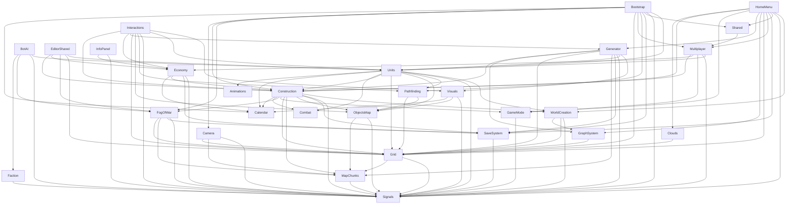

# Feature Dependency Map

Граф залежностей збудовано з asmdef у Assets/Moyva/Scripts (runtime/API/UI модулі, без Editor/Tests).

- Модулів: 29
- Ребер: 104
- Циклів: 0

## Mermaid

```mermaid
graph TD
  Bootstrap --> Calendar
  Bootstrap --> Camera
  Bootstrap --> Construction
  Bootstrap --> FogOfWar
  Bootstrap --> Grid
  Bootstrap --> Multiplayer
  Bootstrap --> Pathfinding
  Bootstrap --> SaveSystem
  Bootstrap --> Shared
  Bootstrap --> Signals
  Bootstrap --> Units
  BotAI --> Faction
  BotAI --> FogOfWar
  BotAI --> Signals
  BotAI --> Units
  Camera --> Grid
  Camera --> MapChunks
  Camera --> Signals
  Clouds --> Grid
  Construction --> Calendar
  Construction --> Combat
  Construction --> FogOfWar
  Construction --> GameMode
  Construction --> Grid
  Construction --> MapChunks
  Construction --> ObjectsMap
  Construction --> SaveSystem
  Construction --> Signals
  Construction --> WorldCreation
  Economy --> Calendar
  Economy --> Construction
  Economy --> SaveSystem
  Economy --> Signals
  EditorShared --> Construction
  EditorShared --> Economy
  EditorShared --> FogOfWar
  EditorShared --> Grid
  EditorShared --> Units
  Faction --> Signals
  FogOfWar --> Grid
  FogOfWar --> MapChunks
  FogOfWar --> SaveSystem
  FogOfWar --> Signals
  GameMode --> Signals
  Generator --> Construction
  Generator --> GraphSystem
  Generator --> Grid
  Generator --> MapChunks
  Generator --> SaveSystem
  Generator --> Signals
  Generator --> Units
  Generator --> Visuals
  GraphSystem --> Grid
  Grid --> MapChunks
  Grid --> Signals
  HomeMenu --> Clouds
  HomeMenu --> Construction
  HomeMenu --> GameMode
  HomeMenu --> Generator
  HomeMenu --> GraphSystem
  HomeMenu --> Grid
  HomeMenu --> Multiplayer
  HomeMenu --> SaveSystem
  HomeMenu --> Shared
  HomeMenu --> Signals
  HomeMenu --> WorldCreation
  InfoPanel --> Economy
  InfoPanel --> Signals
  Interactions --> Construction
  Interactions --> Economy
  Interactions --> Generator
  Interactions --> Grid
  Interactions --> ObjectsMap
  Interactions --> Pathfinding
  Interactions --> Signals
  Interactions --> Units
  Interactions --> Visuals
  MapChunks --> Signals
  Multiplayer --> Construction
  Multiplayer --> Economy
  Multiplayer --> GameMode
  Multiplayer --> Signals
  Multiplayer --> Units
  ObjectsMap --> MapChunks
  ObjectsMap --> Signals
  Pathfinding --> Grid
  Pathfinding --> ObjectsMap
  SaveSystem --> Signals
  Shared --> Multiplayer
  Units --> Animations
  Units --> Calendar
  Units --> Combat
  Units --> Construction
  Units --> Grid
  Units --> ObjectsMap
  Units --> Pathfinding
  Units --> Signals
  Units --> WorldCreation
  Visuals --> Calendar
  Visuals --> ObjectsMap
  Visuals --> Signals
  WorldCreation --> GraphSystem
  WorldCreation --> Grid
  WorldCreation --> Signals
```

## Adjacency List

- Animations: (no outgoing dependencies)
- Bootstrap: Calendar, Camera, Construction, FogOfWar, Grid, Multiplayer, Pathfinding, SaveSystem, Shared, Signals, Units
- BotAI: Faction, FogOfWar, Signals, Units
- Calendar: (no outgoing dependencies)
- Camera: Grid, MapChunks, Signals
- Clouds: Grid
- Combat: (no outgoing dependencies)
- Construction: Calendar, Combat, FogOfWar, GameMode, Grid, MapChunks, ObjectsMap, SaveSystem, Signals, WorldCreation
- Economy: Calendar, Construction, SaveSystem, Signals
- EditorShared: Construction, Economy, FogOfWar, Grid, Units
- Faction: Signals
- FogOfWar: Grid, MapChunks, SaveSystem, Signals
- GameMode: Signals
- Generator: Construction, GraphSystem, Grid, MapChunks, SaveSystem, Signals, Units, Visuals
- GraphSystem: Grid
- Grid: MapChunks, Signals
- HomeMenu: Clouds, Construction, GameMode, Generator, GraphSystem, Grid, Multiplayer, SaveSystem, Shared, Signals, WorldCreation
- InfoPanel: Economy, Signals
- Interactions: Construction, Economy, Generator, Grid, ObjectsMap, Pathfinding, Signals, Units, Visuals
- MapChunks: Signals
- Multiplayer: Construction, Economy, GameMode, Signals, Units
- ObjectsMap: MapChunks, Signals
- Pathfinding: Grid, ObjectsMap
- SaveSystem: Signals
- Shared: Multiplayer
- Signals: (no outgoing dependencies)
- Units: Animations, Calendar, Combat, Construction, Grid, ObjectsMap, Pathfinding, Signals, WorldCreation
- Visuals: Calendar, ObjectsMap, Signals
- WorldCreation: GraphSystem, Grid, Signals

## Cycle Check

✅ Cycles not detected.

## Policy

- Між feature-модулями цикли заборонені.
- Зміни asmdef мають зберігати ациклічність графа.