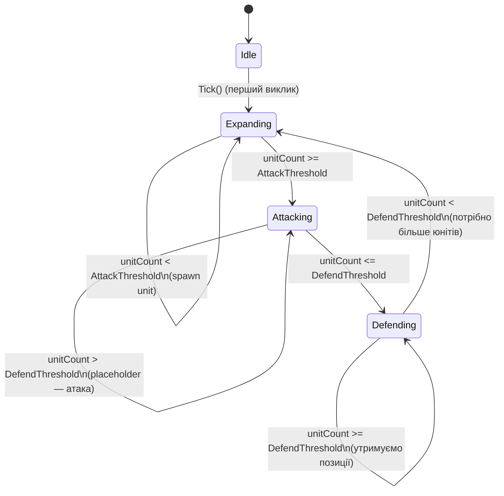

# AI Бот (`BotAI`)

← [Назад до системних документів](../../index.html)

---

## Огляд

Модуль `BotAI` реалізує поведінку AI-бота для Bot-фракцій у грі.  
Архітектура розроблена навколо FSM (Finite State Machine) з підтримкою рівнів складності.

### Компоненти

| Компонент | Роль |
|---|---|
| `IBotController` | Контракт для будь-якого AI-контролера фракції |
| `BotBrain` | FSM-реалізація AI-мозку для однієї Bot-фракції |
| `BotTickScheduler` | Планувальник тіків: ініціалізує ботів та викликає `Tick()` |
| `IBotDifficultySettings` | Параметри складності (tickInterval, thresholds) |
| `BotDifficultySettings` | Пресети Easy / Normal / Hard |
| `BotFogInitializer` | Реєструє туман для Bot-фракцій у `IFogOfWarServiceRegistry` |
| `BotInstaller` | Zenject MonoInstaller для DI-реєстрації |

---

## Архітектура

```
BotInstaller
  ├── IBotDifficultySettings → BotDifficultySettings.Normal()
  └── BotTickScheduler (IInitializable, ITickable)
        ├── IFactionRegistry.GetBotFactions()
        └── DiContainer.Instantiate<BotBrain>(faction)
              ├── FactionDefinition  (ін'єктується як extra arg)
              ├── IFactionRegistry         (з DI-контейнера)
              ├── IUnitFactory             (з DI-контейнера)
              ├── IFactionOwnershipService (з DI-контейнера)
              ├── IUnitService             (з DI-контейнера)
              ├── IUnitMovementService     (з DI-контейнера)
              ├── IBotDifficultySettings   (з DI-контейнера)
              └── IFogOfWarServiceRegistry (optional field inject)
```

`BotTickScheduler` створює по одному `BotBrain` на кожну Bot-фракцію, отриману з `IFactionRegistry`.  
Кожен `BotBrain` незалежно керує поведінкою своєї фракції.

---

## FSM-стани



### Таблиця станів

| Стан | Умова входу | Дії при активному стані | Умова переходу |
|---|---|---|---|
| **Idle** | Початковий стан (spawn) | Нічого | → Expanding (при першому Tick) |
| **Expanding** | Idle; або нестача юнітів | Спавнить нові юніти через `IUnitFactory` | → Attacking (unitCount ≥ AttackThreshold) |
| **Attacking** | Достатньо юнітів | Надсилає юніти до найближчого видимого ворога через `IUnitMovementService` | → Defending (unitCount ≤ DefendThreshold) |
| **Defending** | Втрата юнітів | Утримує базові охоронці (`MinBaseGuards = 2` біля старту) | → Expanding (unitCount < DefendThreshold) |

---

## DifficultyLevel

Рівень складності впливає на поведінку бота через `IBotDifficultySettings`:

| Рівень | `TickInterval` | `AttackThreshold` | `DefendThreshold` | Агресивність |
|---|---|---|---|---|
| **Easy** | 4.0 с | 5 юнітів | 2 юніти | Повільний, реагує пізно |
| **Normal** | 2.0 с | 3 юніти | 1 юніт | Збалансований |
| **Hard** | 1.0 с | 2 юніти | 1 юніт | Швидкий, рано атакує |

Деталі та кастомізація — у [difficulty.md](./difficulty.md).

---

## Ключові інтерфейси

### `IBotController`

```csharp
public interface IBotController
{
    FactionId FactionId { get; }
    void Tick();
}
```

Мінімальний контракт. `BotTickScheduler` викликає `Tick()` на кожному інтервалі.

### `IBotDifficultySettings`

```csharp
public interface IBotDifficultySettings
{
    DifficultyLevel Difficulty    { get; }
    float           TickInterval  { get; }  // секунди між тіками
    int             AttackThreshold { get; }
    int             DefendThreshold { get; }
}
```

### `BotState`

```csharp
public enum BotState { Idle, Expanding, Attacking, Defending }
```

Поточний стан бота доступний через `BotBrain.CurrentState`.

---

## BotBrain — FSM Logic

`BotBrain` реалізує `IBotController` і зберігає поточний стан FSM.

**Конструктор (ін'єктується через Zenject):**

```csharp
public BotBrain(
    FactionDefinition        definition,     // extra arg з BotTickScheduler
    IFactionRegistry         factionRegistry,
    IUnitFactory             unitFactory,
    IFactionOwnershipService ownership,
    IUnitService             unitService,
    IUnitMovementService     movementService,
    IBotDifficultySettings   settings)
// [InjectOptional] IFogOfWarServiceRegistry _fogRegistry (field injection)
```

**Метод `Tick()`:**

```csharp
public void Tick()
{
    var myUnits = _ownership.GetUnitIds(_definition.FactionId);
    int unitCount = myUnits.Count;

    switch (CurrentState)
    {
        case BotState.Idle:      TransitionToExpanding(); break;
        case BotState.Expanding: TickExpanding(unitCount); break;
        case BotState.Attacking: TickAttacking(unitCount); break;
        case BotState.Defending: TickDefending(unitCount); break;
    }
}
```

---

## BotTickScheduler

`BotTickScheduler` реалізує `IInitializable` і `ITickable` з Zenject.

**При `Initialize()`:**
```csharp
foreach (var faction in _factionRegistry.GetBotFactions())
{
    var brain = _container.Instantiate<BotBrain>(new object[] { faction });
    _brains.Add(brain);
}
```

**При `Tick()`:**
```csharp
_timer += Time.deltaTime;
if (_timer < _settings.TickInterval) return;
_timer = 0f;

foreach (var brain in _brains)
    brain.Tick();
```

`TickInterval` визначається через `IBotDifficultySettings` — можна змінювати без зміни коду.

---

## Zenject реєстрація

Щоб підключити BotAI до сцени:

1. Додайте `BotInstaller` як MonoInstaller у Zenject SceneContext.
2. Переконайтесь, що `FactionInstaller` встановлений **перед** `BotInstaller` (для `IFactionRegistry`).

**`BotInstaller.cs`:**

```csharp
public sealed class BotInstaller : MonoInstaller
{
    public override void InstallBindings()
    {
        Container.Bind<IBotDifficultySettings>()
            .FromInstance(BotDifficultySettings.Normal())
            .AsSingle();

        Container.BindInterfacesAndSelfTo<BotTickScheduler>()
            .AsSingle()
            .NonLazy();
    }
}
```

---

## Як зареєструвати власний `IBotController`

1. Створіть клас що реалізує `IBotController`:

```csharp
public sealed class AggressiveBotController : IBotController
{
    public FactionId FactionId => _definition.FactionId;

    [Inject]
    public AggressiveBotController(
        FactionDefinition definition,
        IUnitFactory unitFactory,
        IBotDifficultySettings settings)
    {
        // ...
    }

    public void Tick()
    {
        // Ваша кастомна логіка
    }
}
```

2. Модифікуйте `BotTickScheduler`, щоб він інстанціював ваш клас замість `BotBrain`:

```csharp
// У BotTickScheduler.Initialize():
var brain = _container.Instantiate<AggressiveBotController>(new object[] { faction });
```

> **Альтернатива:** Замість правки `BotTickScheduler` реалізуйте власний `IInitializable` + `ITickable`,
> який отримує `IFactionRegistry` і самостійно створює потрібні контролери.

---

## Розширення у наступних фазах

| Фаза | Що планується |
|---|---|
| Фаза 2 (поточна) | Базова FSM: Idle, Expanding, Attacking, Defending |
| Фаза 2 розширення | Інтеграція `IConstructionService` для будівництва |
| Фаза 2 розширення | Переміщення юнітів через Pathfinding (атака/захист бази) |
| Фаза 6 | Підключення FactionSlot → BotAI залежно від SessionMode |

---

## Тести

```
Assets/Moyva/Scripts/Tests/BotAI/BotBrainFsmTests.cs
```

| Тест | Що перевіряє |
|---|---|
| `WhenNoUnits_StartsInIdle` | Початковий стан — Idle |
| `WhenNoUnits_TickTransitionsToExpanding` | Перший Tick: Idle → Expanding |
| `WhenEnoughUnits_TransitionsToAttacking` | Expanding → Attacking (≥ threshold) |
| `WhenFewUnits_TransitionsToDefending` | Attacking → Defending (≤ threshold) |

**Assembly:** `Kruty1918.Moyva.Tests.BotAI`  
**Тип фікстури:** `ZenjectUnitTestFixture`
