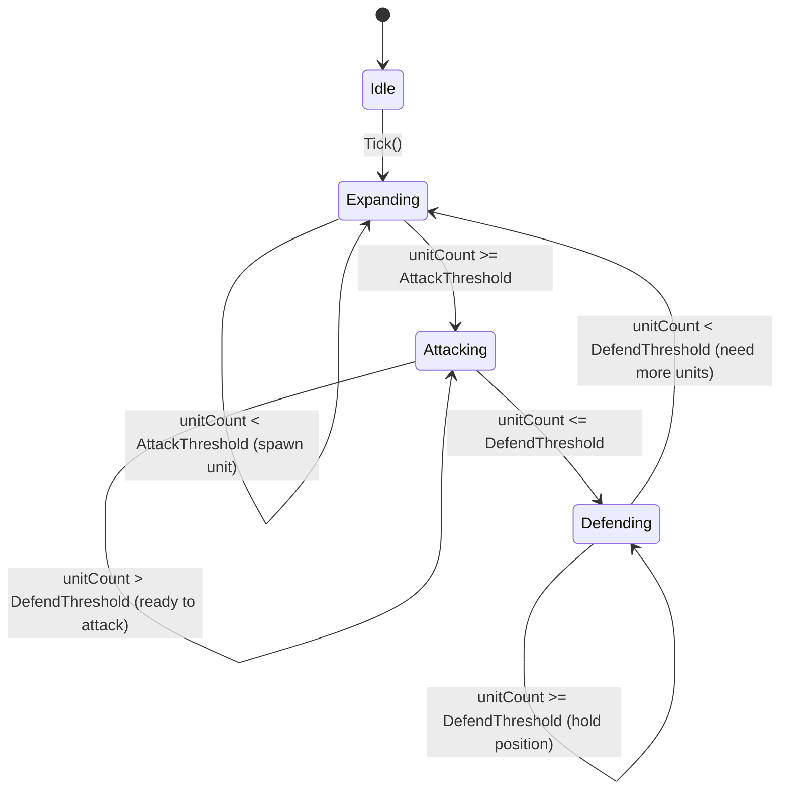

# AI Бот (`BotAI`)

## Архітектура

Модуль `BotAI` складається з трьох основних компонентів:

| Компонент | Роль |
|---|---|
| `IBotController` | Контракт для будь-якого AI-контролера фракції |
| `BotBrain` | Реалізація FSM-логіки для однієї Bot-фракції |
| `BotTickScheduler` | Планувальник тіків: ініціалізує ботів та викликає `Tick()` з throttle |

### Ієрархія

```
BotInstaller
  └── BotTickScheduler (IInitializable, ITickable)
        └── BotBrain (IBotController)  ← один екземпляр на кожну Bot-фракцію
```

`BotTickScheduler` отримує всі `FactionDefinition` з `IFactionRegistry.GetBotFactions()` та через `DiContainer.Instantiate<BotBrain>()` створює по одному `BotBrain` на фракцію.

---

## FSM-стани



### Опис станів

| Стан | Умова входу | Дії | Умова виходу |
|---|---|---|---|
| **Idle** | Початковий стан | Нічого | Завжди → Expanding |
| **Expanding** | З Idle; або мало юнітів | Спавнить нові юніти | `unitCount >= AttackThreshold` → Attacking |
| **Attacking** | Достатньо юнітів | Готується до атаки (placeholder) | `unitCount <= DefendThreshold` → Defending |
| **Defending** | Мало юнітів в атаці | Утримує позиції | `unitCount < DefendThreshold` → Expanding |

---

## DifficultyLevel

Рівень складності впливає на поведінку бота через `IBotDifficultySettings`:

| Рівень | `TickInterval` | `AttackThreshold` | `DefendThreshold` |
|---|---|---|---|
| Easy   | 4 с | 5 | 2 |
| Normal | 2 с | 3 | 1 |
| Hard   | 1 с | 2 | 1 |

Деталі — у [difficulty.md](./difficulty.md).

---

## Як зареєструвати власний IBotController

1. Створіть клас, що реалізує `IBotController`:

```csharp
public sealed class MyCustomBot : IBotController
{
    public FactionId FactionId => _definition.FactionId;

    [Inject]
    public MyCustomBot(FactionDefinition definition) { ... }

    public void Tick() { /* ваша логіка */ }
}
```

2. Зареєструйте у вашому інсталері замість `BotBrain`:

```csharp
Container.Bind<IBotDifficultySettings>()
    .FromInstance(BotDifficultySettings.Hard())
    .AsSingle();

// BotTickScheduler використає будь-який IBotController, що повернений через Instantiate
```

> **Примітка:** `BotTickScheduler` наразі явно інстанціює `BotBrain`. Якщо потрібна розширюваність — вийдіть з `BotTickScheduler` або замініть його власним планувальником.
