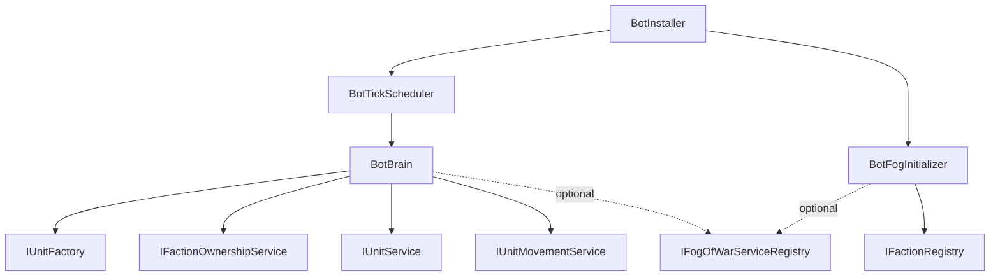

# BotAI — Документація

## Огляд

Модуль `BotAI` (`Kruty1918.Moyva.BotAI`) реалізує AI-контролери для Bot-фракцій. Система побудована на принципі "тік-базованого" оновлення з throttle (раз на 2 секунди) для мінімального навантаження на CPU.

## Архітектура

## Компоненти

| Клас | Опис |
|---|---|
| `IBotController` | Контракт AI-контролера: `FactionId` + `Tick()` |
| `BotBrain` | Основна логіка бота (спавн, атака, захист бази) |
| `BotTickScheduler` | Керує всіма ботами, тікає з інтервалом 2 с |
| `BotFogInitializer` | Реєструє туман для bot-фракцій у `IFogOfWarServiceRegistry` |
| `BotInstaller` | Zenject MonoInstaller |

## Підключення

1. Додати `FactionInstaller` у сцену з налаштованим `GameSessionConfigSO` (бот-фракції типу `Bot`)
2. Додати `BotInstaller` у сцену (після `FactionInstaller` та `FogOfWarInstaller`)

## Логіка BotBrain

Докладніше у [brain.md](brain.md).
