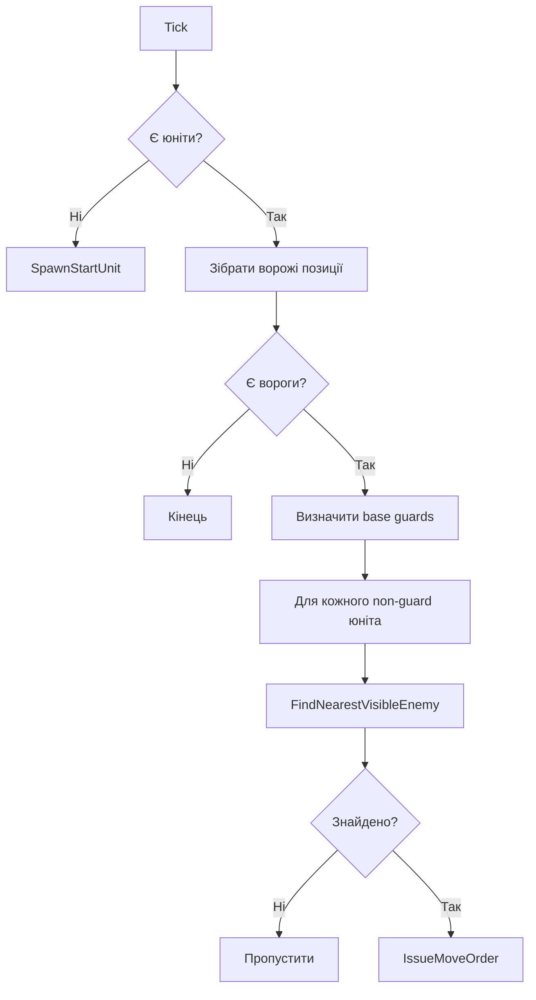

# BotBrain — Логіка AI

## Цикл Tick()

`BotBrain.Tick()` викликається `BotTickScheduler` кожні 2 секунди.

## Параметри

| Константа | Значення | Опис |
|---|---|---|
| `AttackRange` | 8 | Максимальна відстань (Manhattan) для атаки |
| `MinBaseGuards` | 2 | Мінімальна кількість юнітів для захисту бази |

## Туман війни

`BotBrain` опціонально використовує `IFogOfWarServiceRegistry` для перевірки видимості ворожих юнітів. Якщо реєстр не доступний — вважає всіх ворогів у межах дальності видимими.

## Розширення

Для складнішої логіки замініть тіло `Tick()` на дерево рішень (Behavior Tree) або GOAP.
