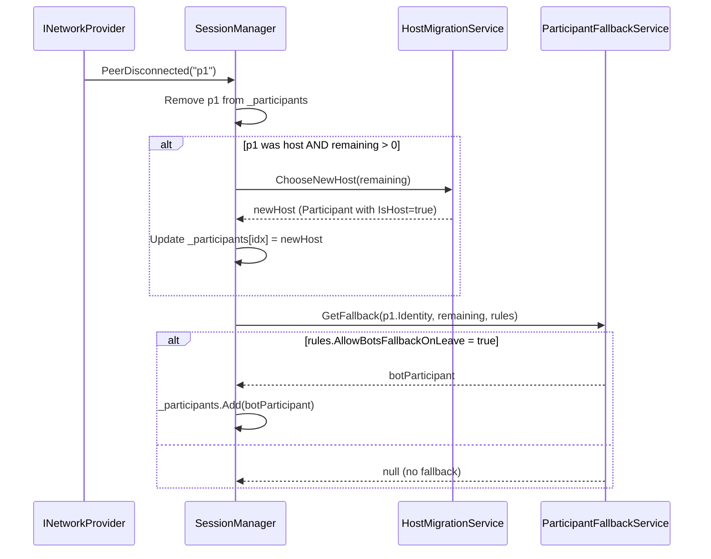

# Міграція хоста (`HostMigrationService`)

← [Назад до огляду](README.md)

---

## Що таке міграція хоста

Коли гравець, який є **хостом** сесії, відключається, інші учасники не повинні втрачати гру.  
**Міграція хоста** — це механізм, який автоматично призначає нового хоста зі списку активних учасників.

---

## Де знаходиться код

```
Assets/Moyva/Scripts/Features/Multiplayer/
  API/IHostMigrationService.cs    ← інтерфейс
  Runtime/HostMigrationService.cs ← реалізація
  Runtime/SessionManager.cs       ← точка виклику (OnPeerDisconnected)
```

---

## Архітектура



---

## Інтерфейс `IHostMigrationService`

```csharp
public interface IHostMigrationService
{
    /// <summary>
    /// Обирає найкращого кандидата на нового хоста з активних учасників.
    /// Повертає null якщо немає підходящих кандидатів.
    /// </summary>
    Participant ChooseNewHost(IReadOnlyList<Participant> remaining);
}
```

---

## Реалізація `HostMigrationService`

**Алгоритм вибору нового хоста:**

1. Перебирає список `remaining` від першого до останнього.
2. Повертає першого учасника, у якого `IsBot = false` (тобто людину).
3. Якщо людей немає — повертає `null` (без хоста).

```csharp
public Participant ChooseNewHost(IReadOnlyList<Participant> remaining)
{
    foreach (var participant in remaining)
    {
        if (!participant.IsBot)
        {
            _logger.Info($"HostMigrationService: новий хост → {participant.Identity}");
            return participant.AsHost();
        }
    }

    _logger.Warn("HostMigrationService: жодного живого людського учасника — хост не призначено.");
    return null;
}
```

**Примітка:** `participant.AsHost()` повертає новий екземпляр `Participant` з `IsHost = true` — зберігаючи незмінність оригінального об'єкта.

---

## Де відбувається виклик — `SessionManager.OnPeerDisconnected`

`SessionManager` підписується на `INetworkProvider.PeerDisconnected` у конструкторі:

```csharp
_network.PeerDisconnected += OnPeerDisconnected;
```

При відключенні пір:

```csharp
private void OnPeerDisconnected(string peerId)
{
    // 1. Знаходимо учасника
    var leaving = _participants.Find(p => p.Identity.PlayerId == peerId);
    if (leaving == null) { /* логуємо і виходимо */ return; }

    // 2. Видаляємо з переліку
    _participants.Remove(leaving);

    // 3. Якщо відключився хост — мігруємо
    if (leaving.IsHost && _participants.Count > 0)
    {
        var newHost = _hostMigration.ChooseNewHost(_participants);
        if (newHost != null)
        {
            int idx = _participants.FindIndex(p => p.Identity.PlayerId == newHost.Identity.PlayerId);
            _participants[idx] = newHost;
        }
    }

    // 4. Додаємо бот-замінника (якщо правила дозволяють)
    var fallback = _participantFallback.GetFallback(leaving.Identity, _participants, _currentRules);
    if (fallback != null) _participants.Add(fallback);
}
```

---

## `ParticipantFallbackService` — заміна гравця ботом

Коли `SessionRules.AllowBotsFallbackOnLeave = true`, гравця що покинув сесію замінює бот:

```csharp
public Participant GetFallback(
    ParticipantIdentity leavingParticipant,
    IReadOnlyList<Participant> remaining,
    SessionRules rules)
{
    if (!rules.AllowBotsFallbackOnLeave) return null;

    var botIdentity = new ParticipantIdentity(
        ParticipantIdentity.BotIdPrefix + leavingParticipant.PlayerId,  // "BOT_p1"
        leavingParticipant.Nickname);

    return new Participant(botIdentity, isBot: true, isHost: false);
}
```

**Формат ID бота-замінника:** `BOT_` + оригінальний `PlayerId`  
Наприклад, якщо гравець мав ID `"alice"`, бот отримає `"BOT_alice"`.

---

## Налаштування через SessionRules

| Поле | Тип | Опис |
|---|---|---|
| `AllowBotsFallbackOnLeave` | `bool` | `true` — замінити гравця, що пішов, ботом |

Приклад налаштування:

```csharp
var rules = new SessionRules(
    mode: SessionMode.MixedHumansAndBots,
    maxParticipants: 4,
    maxHumans: 2,
    maxBots: 2,
    allowBotsFallbackOnLeave: true,   // ← вмикаємо заміну
    allowMatchSaveForAnalysis: false,
    strictParticipantLock: false
);
```

---

## Реєстрація в Zenject

Обидва сервіси реєструються в `MultiplayerInstaller`:

```csharp
Container.Bind<IHostMigrationService>()
    .To<HostMigrationService>()
    .AsSingle();

Container.Bind<IParticipantFallbackService>()
    .To<ParticipantFallbackService>()
    .AsSingle();
```

`SessionManager` автоматично отримає їх через конструктор Zenject.

---

## Сценарії поведінки

### Сценарій 1: Хост відключається, є людини в сесії

```
Учасники: [Alice (host), Bob, Charlie]
Alice відключається
  → HostMigrationService.ChooseNewHost([Bob, Charlie])
  → Повертає Bob.AsHost()
  → Participants: [Bob (host), Charlie]
```

### Сценарій 2: Хост відключається, лишились лише боти

```
Учасники: [Alice (host), BOT_1, BOT_2]
Alice відключається
  → HostMigrationService.ChooseNewHost([BOT_1, BOT_2])
  → Повертає null (немає людей)
  → Participants: [BOT_1, BOT_2] (без хоста)
  → Лог: "No valid host candidate found"
```

### Сценарій 3: Гравець відключається з увімкненим fallback

```
Rules.AllowBotsFallbackOnLeave = true
Учасники: [Alice (host), Bob]
Bob відключається
  → HostMigrationService: Bob не хост → пропускаємо
  → ParticipantFallbackService: повертає Participant("BOT_Bob", isBot=true)
  → Participants: [Alice (host), BOT_Bob]
```

### Сценарій 4: Гравець відключається, fallback вимкнено

```
Rules.AllowBotsFallbackOnLeave = false
Bob відключається
  → ParticipantFallbackService: повертає null
  → Participants: [Alice (host)]  (Bob видалений, нікого не додано)
```

---

## Тести

Тести для міграції — `SessionManagerMigrationTests` у:

```
Assets/Moyva/Scripts/Tests/Multiplayer/SessionManagerTests.cs
```

| Тест | Що перевіряє |
|---|---|
| `OnHostDisconnect_ShouldMigrateHostToRemainingParticipant` | Хост мігрує до наступного живого гравця |
| `OnParticipantDisconnect_ShouldAddBotFallback_WhenRulesAllow` | Бот-замінник додається при `AllowBotsFallbackOnLeave = true` |
| `OnUnknownPeerDisconnect_ShouldNotThrow_AndLogWarning` | Невідомий пір не спричиняє помилку |
